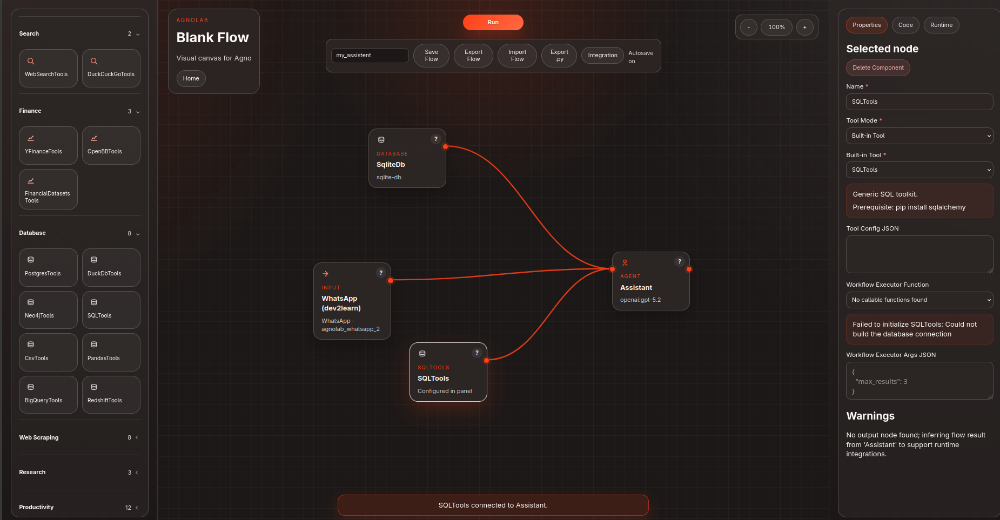

# AgnoLab

AgnoLab is a visual builder for Agno workflows with a low-code canvas, code preview, and executable Python generation.



## What It Does

- Build flows with `input`, `agent`, `team`, `tool`, `condition`, `output`, and `output_api` nodes.
- Configure providers, models, credentials, base URLs, and execution timeout directly from the canvas.
- Use local providers like Ollama, including local model discovery in the UI.
- Work with built-in Agno tools, saved function tools, and starter Excel tools.
- Preview the generated Python before running it.
- Execute flows in an isolated backend runner with debug logs and runtime checks.
- Save, load, and rerun flows by name.
- Export the generated project as code, requirements, and a starter README.
- Inspect runtime output in a cleaner "response only" view when needed.

## Main Features

### Visual Canvas

- Drag and connect nodes on a graph-based canvas.
- Validate the direction of connections through the node model.
- See execution badges and run state directly on the canvas.
- Double-click output nodes to focus on the agent response without debug noise.

### Provider Management

- Choose a provider preset or set a provider manually.
- Use separate fields for provider, model, API key, base URL, extra env values, and timeout.
- Leave credentials blank to fall back to the system environment.
- Support local providers and remote providers through the same properties panel.

### Tooling

- Add built-in tools from the Agno tool catalog.
- Add function tools from saved user code or starter templates.
- Read Excel files with the starter workbook tool.
- Export runtime dependency hints automatically from the selected tools.

### Execution

- Preview code before execution.
- Run flows locally in the backend sandbox.
- Run saved flows by name.
- Capture stdout, stderr, exit code, and warnings.
- Use debug mode to inspect tool calls and agent logs.

### Export

- Generate a runnable Python project from the graph.
- Produce a requirements file for the selected flow nodes.
- Keep generated output portable and readable.

## Repository Layout

- `apps/api`: FastAPI backend for graph validation, code generation, execution, exports, provider tooling, and flow storage.
- `apps/api/app/main.py`: API entrypoint and runtime routes.
- `apps/api/app/compiler.py`: graph-to-Python code generation.
- `apps/api/app/executor.py`: isolated subprocess execution and dependency preflight.
- `apps/api/app/provider_catalog.py`: provider catalog, presets, and codegen mapping.
- `apps/api/app/runtime_dependencies.py`: runtime dependency synthesis for exports.
- `apps/api/app/exporter.py`: export bundle generation.
- `apps/api/app/flow_store.py`: saved-flow persistence.
- `apps/web`: React canvas, properties panel, run console, code preview, and library panels.
- `apps/web/src/App.tsx`: main canvas experience and panel logic.
- `apps/web/src/providerCatalog.ts`: frontend provider catalog and presets.
- `apps/web/src/agentConfig.ts`: agent properties definition.
- `apps/web/src/nodeCatalog.ts`: node templates and defaults.
- `apps/web/src/toolCatalog.ts`: built-in tool catalog.
- `apps/web/src/starterTools.ts`: starter function tools.
- `apps/web/src/api.ts`: frontend API client.
- `docs`: architecture notes and project screenshots.

## Requirements

- Python 3.11+
- Node.js 18+
- An OpenAI API key if you want to use the default OpenAI provider out of the box

## Local Setup

### API

```bash
cd apps/api
python3 -m venv .venv
source .venv/bin/activate
pip install -r requirements.txt
pip install -e .
cp .env.example .env
# set OPENAI_API_KEY in .env if needed
uvicorn app.main:app --reload --port 8000
```

### Web

```bash
cd apps/web
npm install --no-audit --no-fund
export VITE_API_URL=http://localhost:8000
npm run dev
```

### Docker

```bash
export OPENAI_API_KEY="your-key"
docker compose up --build
```

The API will be available at `http://localhost:8000` and the web app at `http://localhost:5173`.
The services stay separated in Docker, but `docker compose` starts both together. The web image receives `VITE_API_URL` at build time, so you can point it to another backend later without changing the source code.
If you want to connect to a local Ollama instance from inside Docker, use `http://host.docker.internal:11434` as the provider base URL.

### Render

For Render, keep the services separate:

- Publish `apps/api` as a Web Service.
- Publish `apps/web` as a Static Site.
- Set `VITE_API_URL` in the web service build environment to the public URL of the API, for example `https://agnolab-api.onrender.com`.

This keeps backend and frontend independent while still letting you deploy both parts of the same repository.

## Provider Support

AgnoLab supports multiple providers through the canvas properties panel, including local options like Ollama as well as remote providers such as OpenAI, Anthropic, Google, Groq, Mistral, Cohere, Cerebras, OpenRouter, LiteLLM, Azure, Bedrock, Vertex, IBM WatsonX, Portkey, LangDB, and others supported by Agno.

For local providers, the agent properties include a configurable execution timeout so slower models do not stop the flow too early.

## Exported Flows

When you export a flow, AgnoLab generates:

- `main.py` with the compiled Agno workflow
- `requirements.txt` with the runtime dependencies for the selected nodes
- `README.md` for the exported project

## License

This project is licensed under the MIT License. See [LICENSE](LICENSE) for details.
