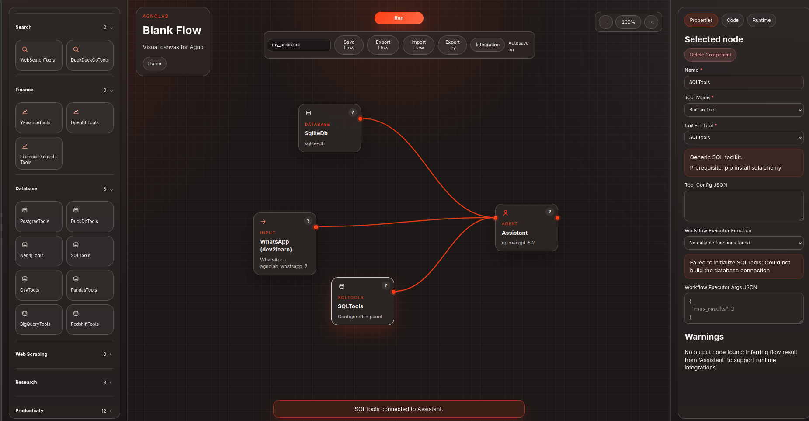

# AgnoLab

AgnoLab is a visual builder for Agno workflows with a low-code canvas, code preview, and executable Python generation.



## Demo Video

- Watch on YouTube: https://www.youtube.com/watch?v=fQjQHiIHMsM

## What It Does

- Build flows with `input`, `agent`, `team`, `tool`, `condition`, `output`, and `output_api` nodes.
- Configure providers, models, credentials, base URLs, and execution timeout directly from the canvas.
- Use local providers like Ollama, including local model discovery in the UI.
- Work with built-in Agno tools, saved function tools, and starter Excel tools.
- Preview the generated Python before running it.
- Execute flows in an isolated backend runner with debug logs and runtime checks.
- Save, load, and rerun flows by name.
- Export the generated project as code, requirements, and a starter README.
- Inspect runtime output in a cleaner "response only" view when needed.

## Available Resources

- Visual flow builder (canvas-based editor)
- Provider presets and manual provider/model configuration
- Built-in tools, starter function tools, and Excel helper tool
- Python code preview and local backend execution
- Save/load flows and run saved flows by name
- Export generated projects with `main.py`, `requirements.txt`, and starter `README.md`
- Docker and Docker Dev environments
- Optional WhatsApp gateway in development compose

## How to Run the Project

You can run AgnoLab either locally (API + Web) or with Docker.

- Local run: follow [Local Setup](#local-setup)
- Production-like containers: follow [Docker](#docker)
- Development containers with hot reload: follow [Development Mode (Docker Dev)](#development-mode-docker-dev)

## Main Features

### Visual Canvas

- Drag and connect nodes on a graph-based canvas.
- Validate the direction of connections through the node model.
- See execution badges and run state directly on the canvas.
- Double-click output nodes to focus on the agent response without debug noise.

### Provider Management

- Choose a provider preset or set a provider manually.
- Use separate fields for provider, model, API key, base URL, extra env values, and timeout.
- Leave credentials blank to fall back to the system environment.
- Support local providers and remote providers through the same properties panel.

### Tooling

- Add built-in tools from the Agno tool catalog.
- Add function tools from saved user code or starter templates.
- Read Excel files with the starter workbook tool.
- Export runtime dependency hints automatically from the selected tools.

### Execution

- Preview code before execution.
- Run flows locally in the backend sandbox.
- Run saved flows by name.
- Capture stdout, stderr, exit code, and warnings.
- Use debug mode to inspect tool calls and agent logs.

### Export

- Generate a runnable Python project from the graph.
- Produce a requirements file for the selected flow nodes.
- Keep generated output portable and readable.

## Repository Layout

- `apps/api`: FastAPI backend for graph validation, code generation, execution, exports, provider tooling, and flow storage.
- `apps/api/app/main.py`: API entrypoint and runtime routes.
- `apps/api/app/compiler.py`: graph-to-Python code generation.
- `apps/api/app/executor.py`: isolated subprocess execution and dependency preflight.
- `apps/api/app/provider_catalog.py`: provider catalog, presets, and codegen mapping.
- `apps/api/app/runtime_dependencies.py`: runtime dependency synthesis for exports.
- `apps/api/app/exporter.py`: export bundle generation.
- `apps/api/app/flow_store.py`: saved-flow persistence.
- `apps/web`: React canvas, properties panel, run console, code preview, and library panels.
- `apps/web/src/App.tsx`: main canvas experience and panel logic.
- `apps/web/src/providerCatalog.ts`: frontend provider catalog and presets.
- `apps/web/src/agentConfig.ts`: agent properties definition.
- `apps/web/src/nodeCatalog.ts`: node templates and defaults.
- `apps/web/src/toolCatalog.ts`: built-in tool catalog.
- `apps/web/src/starterTools.ts`: starter function tools.
- `apps/web/src/api.ts`: frontend API client.
- `docs`: architecture notes and project screenshots.

## Requirements

- Python 3.11+
- Node.js 18+
- An OpenAI API key if you want to use the default OpenAI provider out of the box

## Local Setup

### API

```bash
cd apps/api
python3 -m venv .venv
source .venv/bin/activate
pip install -r requirements.txt
pip install -e .
cp .env.example .env
# set OPENAI_API_KEY in .env if needed
uvicorn app.main:app --reload --port 8000
```

### Web

```bash
cd apps/web
npm install --no-audit --no-fund
export VITE_API_URL=http://localhost:8000
npm run dev
```

### Docker (production)

The production compose runs AgnoLab plus every self-hostable resource its flows can
use: Postgres with pgvector, Redis, RabbitMQ, Kafka, NATS, and the WhatsApp gateway.

```bash
cp .env.example .env
# Fill in the required secrets. Generate them with: openssl rand -hex 32
docker compose up --build -d
```

Compose refuses to start until the required secrets are set — `AGNOLAB_API_KEY`,
`WHATSAPP_GATEWAY_SECRET_KEY`, `POSTGRES_PASSWORD`, `REDIS_PASSWORD`, and
`RABBITMQ_PASSWORD`. See [Security](#security) for why the API key is mandatory.

The web app is served on `http://localhost:5173` and the API on `http://localhost:8000`.

**Backing services are not published to the host.** The API reaches them over the
internal network, so use these hostnames inside your flow nodes (not `localhost`):

| Resource | Use this in the node |
| --- | --- |
| Postgres / pgvector | `postgresql+psycopg://agnolab:<POSTGRES_PASSWORD>@postgres:5432/agnolab` |
| Redis | `redis://:<REDIS_PASSWORD>@redis:6379/0` |
| RabbitMQ | `amqp://agnolab:<RABBITMQ_PASSWORD>@rabbitmq:5672/` |
| Kafka | `kafka:19092` |
| NATS | `nats://nats:4222` |

The RabbitMQ management UI (`:15672`) and the WhatsApp gateway (`:21465`, needed to
scan the pairing QR code) are bound to loopback only.

AWS SQS and Google Pub/Sub are cloud services: point those nodes at the real
endpoints and supply credentials. The local emulators are development-only.

The web image receives `VITE_API_URL` at build time, so you can point it at another
backend without changing the source. To reach a local Ollama instance from inside
Docker, use `http://host.docker.internal:11434` as the provider base URL.

Saved flows, runtime variables, and flow authentication settings persist under
`apps/api/data` by default; set `AGNOLAB_DATA_DIR` to relocate it, and back it up.

### Development Mode (Docker Dev)

```bash
docker compose -f docker-compose.dev.yml up --build
```

This development compose mounts `apps/api` and `apps/web` into the containers, runs `uvicorn --reload` for the API, and starts the Vite dev server with polling enabled for reliable hot reload inside Docker. The dev web app stays on `http://localhost:5173`, the API on `http://localhost:8000`, and the WhatsApp gateway on `http://localhost:21465`.

### Render

For Render, keep the services separate:

- Publish `apps/api` as a Web Service.
- Publish `apps/web` as a Static Site.
- Set `VITE_API_URL` in the web service build environment to the public URL of the API, for example `https://agnolab-api.onrender.com`.

This keeps backend and frontend independent while still letting you deploy both parts of the same repository.

## Security

**AgnoLab generates and executes Python code.** Anyone who can reach the API can make
it run arbitrary code on the host. Treat the API as a privileged service and never
expose it to an untrusted network without an API key.

### Authentication

Set `AGNOLAB_API_KEY` to a long random secret. Clients then send it as `X-API-Key: <key>`
or `Authorization: Bearer <key>`. When the variable is unset the API runs open — fine
for single-user local development, and the server logs a warning at startup. The
production compose **requires** it.

External trigger endpoints (webhook/form, WhatsApp events, run-by-name) are exempt from
the global key: they authenticate per-flow with the bearer token configured on the flow.

### Secrets

No secret you type into the canvas is written into generated or exported code. Provider
API keys, provider environment values, and email passwords are read via `os.getenv(...)`
in the generated source and injected into the runner's environment at execution time.

### Executor guards

| Variable | Default | Purpose |
| --- | --- | --- |
| `AGNOLAB_MAX_EXECUTION_SECONDS` | `300` | Hard ceiling on any run, overriding per-flow timeouts |
| `AGNOLAB_MAX_OUTPUT_MB` | `128` | Cap on what a run may write to disk |
| `AGNOLAB_MAX_MEMORY_MB` | off | Optional memory cap (off by default: ML/vector libraries reserve large address ranges) |
| `AGNOLAB_ISOLATE_ENV` | off (on in prod compose) | Runner sees only system essentials, known provider credential vars, and the flow's own secrets — not the full host environment |
| `AGNOLAB_FORWARD_ENV` | — | Extra host env vars to forward into the isolated runner |

Runs also get POSIX CPU/output limits and are killed as a whole process group on timeout.

### CORS

`AGNOLAB_CORS_ORIGINS` takes a comma-separated list of allowed browser origins; it
defaults to the local dev servers. A wildcard is accepted but disables credentialed CORS.

## Provider Support

AgnoLab supports multiple providers through the canvas properties panel, including local options like Ollama as well as remote providers such as OpenAI, Anthropic, Google, Groq, Mistral, Cohere, Cerebras, OpenRouter, LiteLLM, Azure, Bedrock, Vertex, IBM WatsonX, Portkey, LangDB, and others supported by Agno.

For local providers, the agent properties include a configurable execution timeout so slower models do not stop the flow too early.

## Exported Flows

When you export a flow, AgnoLab generates:

- `main.py` with the compiled Agno workflow
- `requirements.txt` with the runtime dependencies for the selected nodes
- `README.md` for the exported project

There are two export targets:

- **Run-once script** (`Export .py`) — the flow executes once and prints its result.
- **AgentOS server app** (`Export Server App`) — emits an `AgentOS(...)` FastAPI app that
  serves the flow's agents, teams, and workflows as an API. Run it with `python main.py`
  and it listens on port 7777.

No secrets are included in either export; supply them via the environment.

## License

This project is licensed under the MIT License. See [LICENSE](LICENSE) for details.
